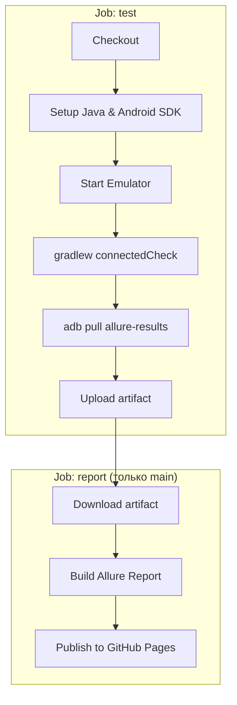

# kaspresso-example

Пример UI-тестов на [Kaspresso](https://kasperskylab.github.io/Kaspresso/) с отчётами Allure и CI на GitHub Actions.

## Как устроен CI

Воркфлоу запускается при **push** и **pull request** в любую ветку, а также по кнопке **Run workflow** (ручной запуск).

### Этапы

1. **test** — на Ubuntu поднимается эмулятор (API 31, KVM), прогоняются инструментальные тесты, результаты Allure вытягиваются с устройства и загружаются артефактом.
2. **report** — выполняется только при push в `main` или при ручном запуске с ветки `main`: скачивается артефакт, [simple-elf/allure-report-action](https://github.com/simple-elf/allure-report-action) строит отчёт с историей, [peaceiris/actions-gh-pages](https://github.com/peaceiris/actions-gh-pages) публикует его в ветку `gh-pages`.

Отчёт доступен на GitHub Pages после настройки **Settings → Pages → Source: Deploy from a branch → gh-pages**.